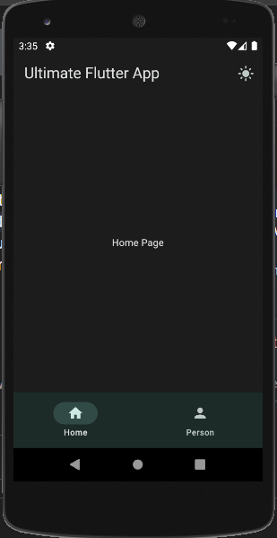

# Ultimate Flutter App

A Flutter mobile application featuring:

✅ User Authentication (Firebase)  
✅ Login Page  
✅ Home Page  
✅ Profile Page  
✅ Integration with 3rd Party REST APIs

---

## ✨ Features

- **Firebase Authentication**
  - Email/password login
  - Secure user sessions
- **Login Page**
  - User-friendly UI
  - Form validation
- **Home Page**
  - Dashboard for app features
  - Fetches data from external REST APIs
- **Profile Page**
  - Display user details
  - Edit profile functionality (optional)
- **3rd Party API Integration**
  - Fetch and display external data (e.g. posts, weather, news)

---

## 📸 Screenshots

### Login Page

### Home Page

### Profile Page

---

## 🛠️ Tech Stack

- [Flutter](https://flutter.dev/)
- [Dart](https://dart.dev/)
- [Firebase Authentication](https://firebase.google.com/docs/auth)
- [http](https://pub.dev/packages/http)

---

## 🚀 Getting Started

### Prerequisites

- Flutter SDK installed
- Firebase project set up
- Emulator or physical device

---

## 📞 Contact

- mac.window.10@gmail.com
